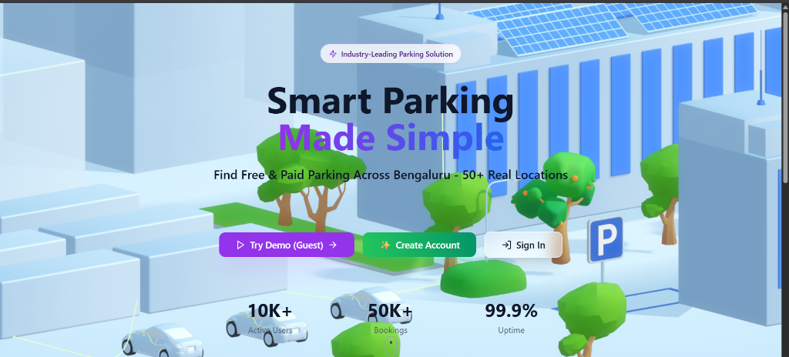
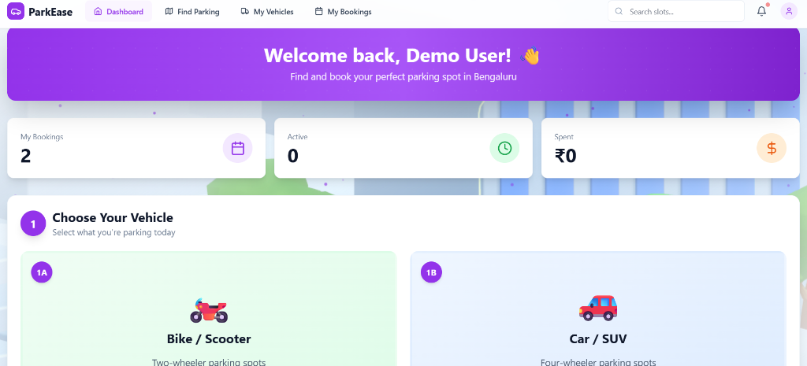
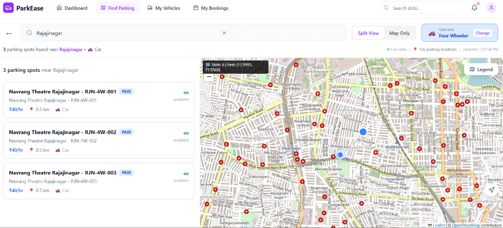
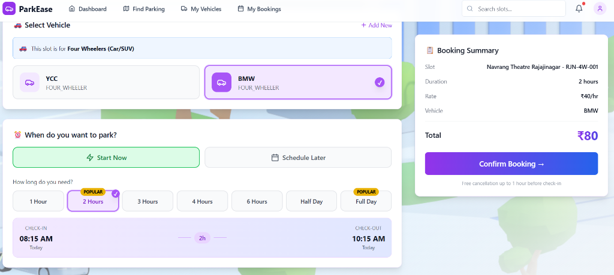

# 🚗 ParkEase: Smart Parking Management System

[](https://www.oracle.com/java/)
[](https://spring.io/projects/spring-boot)
[](https://reactjs.org/)
[](https://opensource.org/licenses/MIT)

**ParkEase** is a comprehensive, production-ready solution for modern parking management. It bridges the gap between drivers and parking providers with real-time slot tracking, easy bookings, and seamless check-ins.

---

## ✨ Key Features

- 📍 **Real-time Map Integration**: Find parking spots near you with interactive Leaflet maps.
- 🕒 **Smart Bookings**: Reserve slots in advance with automated pricing and duration selection.
- 💳 **Seamless Payments**: Multiple payment options for a hassle-free experience.
- 🔐 **Secure Auth**: JWT-based authentication for both Users and Administrators.
- 📊 **Admin Dashboard**: Full control over slots, user management, and revenue tracking.
- 📧 **Instant Notifications**: Receive booking confirmations and QR codes via email.

---

## 📸 Screenshots

| Landing Page | User Dashboard |
| :---: | :---: |
|  |  |

| Interactive Map | Booking Flow |
| :---: | :---: |
|  |  |

---

## 🛠️ Tech Stack

- **Frontend**: React 18 (Vite), Tailwind CSS, Framer Motion, Leaflet, Lucide-React

- **Backend**: Java 21, Spring Boot 3.2, Spring Security 6 (JWT), MySQL, Hibernate/JPA, ZXing (QR), Swagger UI (OpenAPI 3)

---

## 🚀 Quick Start

### Prerequisites
- JDK 21
- Node.js (v22+)
- MySQL

### Setup
1. **Clone the Repository**
   ```bash
   git clone https://github.com/your-username/parking-management-system.git
   cd parking-management-system
   ```

2. **Backend Setup**
   ```bash
   cd parkease-backend
   # Update src/main/resources/application.properties with your DB credentials
   mvn spring-boot:run
   ```

3. **Frontend Setup**
   ```bash
   cd parkease-frontend
   npm install
   npm run dev
   ```

For detailed deployment instructions (Render/Docker), see [DEPLOY_INSTRUCTIONS.md](DEPLOY_INSTRUCTIONS.md).

---

## 🤝 Contributing
1. Fork & Branch → 2. Commit → 3. Push → 4. Pull Request

## 📄 License
MIT License. See [LICENSE](LICENSE).

---
**⭐ Give it a star if you find it useful!**

